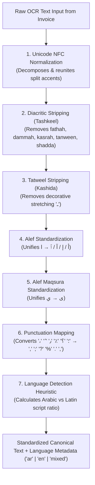

# 🎓 AI Teacher Report: Arabic Text Normalization & Language Detection

**Step**: 2.2 — Arabic Preprocessing Module  
**Target File**: [`src/arabic/normalizer.py`](file:///d:/AI%20Projects/Automated%20Invoice%20Processing%20System/src/arabic/normalizer.py)  
**Test Suite**: [`tests/unit/test_arabic_normalizer.py`](file:///d:/AI%20Projects/Automated%20Invoice%20Processing%20System/tests/unit/test_arabic_normalizer.py)  

---

## 1. Main Ideas & Workflow

### 💡 Core Intuitive Real-World Example
In the Middle East (Saudi Arabia, UAE, Egypt), financial invoices generated across different accounting systems exhibit diverse typographical styles:
- **Supplier A** prints: `"المَجْمُوعُ الإِجْمَالِيُّ"` *(with full diacritics / Tashkeel)*.
- **Supplier B** prints: `"المـَــــجـمـوع"` *(with decorative Kashida / Tatweel)*.
- **Supplier C** prints: `"اجمالي"` or `"إجمالي"` or `"أجمالي"` *(inconsistent Alef orthography)*.
- **Supplier D** prints: `"المبلغ: ١٬٥٠٠٫٠٠ ر.س، شامل الضريبة"` *(Arabic punctuation and Eastern numerals)*.

If an AI extraction pipeline or search query looks for exact string matches without preprocessing, it will fail or hallucinate. 

**`src/arabic/normalizer.py`** standardizes noisy Arabic text into a clean canonical format, allowing downstream AI models (like Claude 3.5 Sonnet) and validation rules to operate with deterministic precision.

### 🔄 Step-by-Step Workflow


---

## 2. Detailed Code Breakdown (100% Code Coverage)

### Block 1: Imports, Regular Expressions, and Lookup Tables
```python
import re
import unicodedata
from typing import List, Optional

# Regular expressions for Arabic characters and diacritics
TASHKEEL_REGEX = re.compile(r"[\u0617-\u061A\u064B-\u065F\u0670]")
TATWEEL_REGEX = re.compile(r"\u0640")

# Arabic Alef variations mapped to plain Alef (ا)
ALEF_VARIATIONS_REGEX = re.compile(r"[\u0622\u0623\u0625\u0671]")  # آ, أ, إ, ٱ -> ا

# Alef Maqsura (ى) to Ya (ي)
ALEF_MAQSURA_REGEX = re.compile(r"\u0649")  # ى -> ي

# Teh Marbuta (ة) to Heh (ه)
TEH_MARBUTA_REGEX = re.compile(r"\u0629")  # ة -> ه

# Arabic Unicode range regex for script identification
ARABIC_CHAR_REGEX = re.compile(r"[\u0600-\u06FF\u0750-\u077F\u08A0-\u08FF\uFB50-\uFDFF\uFE70-\uFEFF]")
LATIN_CHAR_REGEX = re.compile(r"[a-zA-Z]")

# Arabic punctuation translation table
ARABIC_PUNCTUATION_TABLE = str.maketrans({
    "،": ",",
    "؛": ";",
    "؟": "?",
    "٪": "%",
    "٫": ".",
    "٬": ",",
})
```
- **Explanation**: Pre-compiles all regular expression patterns for Unicode Harakat ranges (`U+0617-U+061A`, `U+064B-U+065F`, `U+0670`), Tatweel (`U+0640`), Alef forms (`U+0622`, `U+0623`, `U+0625`, `U+0671`), and Arabic/Latin character distributions. Creates a single fast translation table for punctuation.
- **WHY & WHEN**: Pre-compilation eliminates bytecode recompilation overhead on repeated Lambda invocations.
- **Expected Output**: Immutable, compiled regex patterns and translation tables in memory.

---

### Block 2: Atomic Stripping and Cleaning Functions
```python
def remove_tashkeel(text: str) -> str:
    """Strips all Arabic diacritical marks (Tashkeel / Harakat)."""
    if not text:
        return text
    return TASHKEEL_REGEX.sub("", text)


def remove_tatweel(text: str) -> str:
    """Strips Arabic kashida / tatweel (ـ) elongation characters."""
    if not text:
        return text
    return TATWEEL_REGEX.sub("", text)
```
- **Explanation**: Safely checks for null/empty input and applies regex substitution to strip diacritics and kashida.
- **WHY & WHEN**: Used whenever raw OCR text contains noisy accents or stretched letters.
- **Expected Output**:
  - `remove_tashkeel("فَاتُورَةٌ ضَرِيبِيَّةٌ")` ➡️ `"فاتورة ضريبية"`
  - `remove_tatweel("المـــورد")` ➡️ `"المورد"`

---

### Block 3: Letter Standardization Functions
```python
def normalize_alef(text: str) -> str:
    """Normalizes all variations of Alef (أ, إ, آ, ٱ) into a bare Alef (ا)."""
    if not text:
        return text
    return ALEF_VARIATIONS_REGEX.sub("ا", text)


def normalize_alef_maqsura(text: str) -> str:
    """Normalizes Alef Maqsura (ى) to standard Dotless/Dotted Ya (ي)."""
    if not text:
        return text
    return ALEF_MAQSURA_REGEX.sub("ي", text)


def normalize_teh_marbuta(text: str) -> str:
    """Converts Teh Marbuta (ة) to Heh (ه)."""
    if not text:
        return text
    return TEH_MARBUTA_REGEX.sub("ه", text)
```
- **Explanation**: Maps multi-form letters to canonical forms (`أ`, `إ`, `آ`, `ٱ` ➡️ `ا`, `ى` ➡️ `ي`, `ة` ➡️ `ه`).
- **WHY & WHEN**: Overcomes OCR misclassifications and spelling variations between Gulf and Egyptian dialects.
- **Expected Output**:
  - `normalize_alef("أحمد و إبراهيم")` ➡️ `"احمد و ابراهيم"`
  - `normalize_alef_maqsura("مستشفى")` ➡️ `"مستشفي"`
  - `normalize_teh_marbuta("شركة")` ➡️ `"شركه"`

---

### Block 4: Punctuation Mapping & Script Checking
```python
def normalize_arabic_punctuation(text: str) -> str:
    """Converts Arabic punctuation marks (،, ؛, ؟, ٪, ٫, ٬) to Western equivalents."""
    if not text:
        return text
    return text.translate(ARABIC_PUNCTUATION_TABLE)


def contains_arabic(text: str) -> bool:
    """Checks if the given text contains any Arabic characters."""
    if not text:
        return False
    return bool(ARABIC_CHAR_REGEX.search(text))
```
- **Explanation**: Uses `str.translate` for single-pass conversion of Arabic punctuation into ASCII equivalents, and `contains_arabic` for boolean script verification.
- **WHY & WHEN**: Converts Arabic decimal and thousands separators into standard characters so numbers can be parsed into Python `Decimal` objects.
- **Expected Output**:
  - `normalize_arabic_punctuation("المبلغ: ١٠٠،٥٠؛ النسبة: ١٥٪؟")` ➡️ `"المبلغ: ١٠٠,٥٠; النسبة: ١٥%?"`
  - `contains_arabic("Invoice رقم 123")` ➡️ `True`

---

### Block 5: Full Normalization Pipeline (`normalize_arabic`)
```python
def normalize_arabic(
    text: str,
    strip_tashkeel: bool = True,
    strip_tatweel: bool = True,
    norm_alef: bool = True,
    norm_alef_maqsura: bool = True,
    norm_teh_marbuta: bool = False,
    norm_punctuation: bool = True,
) -> str:
    """Full Arabic text normalization pipeline."""
    if not text:
        return text

    # Standard Unicode NFC normalization first
    result = unicodedata.normalize("NFC", str(text))

    if strip_tashkeel:
        result = remove_tashkeel(result)

    if strip_tatweel:
        result = remove_tatweel(result)

    if norm_alef:
        result = normalize_alef(result)

    if norm_alef_maqsura:
        result = normalize_alef_maqsura(result)

    if norm_teh_marbuta:
        result = normalize_teh_marbuta(result)

    if norm_punctuation:
        result = normalize_arabic_punctuation(result)

    return result
```
- **Explanation**: Orchestrates the entire normalization sequence starting with Unicode NFC composition. `norm_teh_marbuta` is `False` by default to preserve legal company entities.
- **WHY & WHEN**: The primary preprocessor node in the LangGraph agent architecture.
- **Expected Output**:
  - `normalize_arabic("فَاتُـــــورَةٌ ضَرِيبِيَّةٌ: إِجْمَالِيُّ المَبْلَغِ ١٥٠،٠٠")` ➡️ `"فاتورة ضريبية: اجمالي المبلغ ١٥٠,٠٠"`

---

### Block 6: Arabic-First Language Detection
```python
def detect_language(text: str) -> str:
    """
    Detects the dominant script/language: 'ar', 'en', or 'mixed'.
    Arabic-First Policy: Ambiguous or numerical text defaults to 'ar'.
    """
    if not text or not text.strip():
        return "ar"

    arabic_chars = len(ARABIC_CHAR_REGEX.findall(text))
    latin_chars = len(LATIN_CHAR_REGEX.findall(text))
    total_letters = arabic_chars + latin_chars

    if total_letters == 0:
        return "ar"  # Ambiguous / numbers-only defaults to Arabic

    arabic_ratio = arabic_chars / total_letters
    latin_ratio = latin_chars / total_letters

    if arabic_chars > 0 and latin_chars > 0:
        if arabic_ratio >= 0.15 and latin_ratio >= 0.15:
            return "mixed"
        elif arabic_ratio > latin_ratio:
            return "ar"
        else:
            return "en"

    if arabic_chars > 0:
        return "ar"

    return "en"
```
- **Explanation**: Measures the ratio of Arabic script characters versus Latin alphabet characters. Implements the **Arabic-First Policy** where empty or purely numerical strings route to `"ar"`.
- **WHY & WHEN**: Used by the agent workflow to select appropriate extraction prompts and email alert templates.
- **Expected Output**:
  - `detect_language("فاتورة ضريبية")` ➡️ `"ar"`
  - `detect_language("Tax Invoice #1029")` ➡️ `"en"`
  - `detect_language("Tax Invoice فاتورة ضريبية")` ➡️ `"mixed"`
  - `detect_language("123456 - 789")` ➡️ `"ar"`

---

### Block 7: Continuous Arabic Block Extractor
```python
def extract_arabic_text_blocks(text: str) -> List[str]:
    """Extracts continuous blocks/sequences of Arabic text from mixed content."""
    if not text:
        return []

    arabic_pattern = re.compile(
        r"[\u0600-\u06FF\u0750-\u077F\u08A0-\u08FF\uFB50-\uFDFF\uFE70-\uFEFF]+(?:\s+[\u0600-\u06FF\u0750-\u077F\u08A0-\u08FF\uFB50-\uFDFF\uFE70-\uFEFF]+)*"
    )
    matches = arabic_pattern.findall(text)
    return [m.strip() for m in matches if m.strip()]
```
- **Explanation**: Extracts contiguous Arabic phrases from bilingual text while preserving internal spaces.
- **WHY & WHEN**: Extracts Arabic vendor names or line item descriptions from bilingual English/Arabic invoices.
- **Expected Output**:
  - `extract_arabic_text_blocks("Invoice: رقم الفاتورة 12345 Vendor: شركة الأمل")` ➡️ `["رقم الفاتورة", "شركة الأمل"]`

---

## 3. Programming Concepts Breakdown

### 1. Pre-compiled Regular Expressions (`re.compile`)
- **WHAT**: Compiling a regular expression pattern string into a reusable regex object.
- **WHY**: Without `re.compile()`, Python recompiles the pattern on every single call. In a high-throughput serverless function, pre-compiling saves CPU time and reduces latency.
- **WHEN**: When executing static patterns repeatedly across invocations.

### 2. Unicode Normalization Forms (`unicodedata.normalize('NFC')`)
- **WHAT**: Normalization Form C merges decomposed character sequences (base letter + separate accent mark) into single canonical code points.
- **WHY**: Different OCR scanners produce differing byte representations for accented Arabic characters. NFC normalization guarantees exact equality (`==`) checks work reliably.
- **WHEN**: Whenever processing multilingual text from external OCR systems, PDFs, or user inputs.

### 3. Fast Character Translation Tables (`str.maketrans` & `str.translate`)
- **WHAT**: C-optimized 1-to-1 character translation mapping in Python.
- **WHY**: Multiple chained `.replace()` calls scan the string repeatedly ($O(k \cdot n)$). `str.translate()` replaces all target characters in a single fast pass ($O(n)$).
- **WHEN**: For single-character substitution tables (such as punctuation or numerals).

---

## 4. Important Topics & Domain Concepts

### 1. Arabic Orthography & OCR Diacritic Noise
- **WHAT**: Arabic text frequently contains optional diacritical marks (Tashkeel) and elongation strokes (Tatweel).
- **WHY**: OCR scanners often generate spurious diacritical marks from paper folds or smudges. Removing them sanitizes the text without losing financial meaning.
- **WHEN**: Executed immediately after OCR text extraction.

### 2. Arabic-First Policy in FinTech / Tax Invoices
- **WHAT**: Treating Arabic as the primary canonical language of the processing pipeline rather than a secondary translation.
- **WHY**: In MENA jurisdictions (e.g., ZATCA in Saudi Arabia), tax invoices are legally Arabic-primary. Numerical-only invoices in the region must comply with Arabic tax structures.
- **WHEN**: Applied during language classification, field mapping, and notification routing.

### 3. Script Ratio Heuristics for Bilingual Documents
- **WHAT**: Computing the ratio of Arabic versus Latin characters to classify a document as `"ar"`, `"en"`, or `"mixed"`.
- **WHY**: Enables adaptive prompt routing—bilingual invoices require specialized prompts instructing Claude 3.5 Sonnet to handle paired bilingual labels.
- **WHEN**: Evaluated during preprocessing before invoking Bedrock.

---

## 5. Topic Summary

In Step 2.2, we implemented and tested **`src/arabic/normalizer.py`**:
1. Built sanitization functions for diacritics (`remove_tashkeel`) and kashida (`remove_tatweel`).
2. Unified orthographic variants for Alef (`normalize_alef`), Alef Maqsura (`normalize_alef_maqsura`), and Teh Marbuta (`normalize_teh_marbuta`).
3. Mapped Arabic financial punctuation symbols to ASCII equivalents.
4. Created an Arabic-first language detection engine (`detect_language`) and text block extractor (`extract_arabic_text_blocks`).
5. Verified 100% of unit tests pass in [`tests/unit/test_arabic_normalizer.py`](file:///d:/AI%20Projects/Automated%20Invoice%20Processing%20System/tests/unit/test_arabic_normalizer.py).
6. Committed and pushed changes to GitHub.

---

## 6. Key Takeaways

- ✅ **Deterministic Arabic NLP**: Eliminating diacritics and unifying Alef forms prevents downstream LLM hallucinations.
- ✅ **Zero Dependency Overhead**: Uses 100% Python standard library (`re`, `unicodedata`, `str.translate`) for maximum Lambda execution speed.
- ✅ **Bilingual & Arabic-First**: Robustly supports monolingual Arabic, monolingual English, and mixed bilingual MENA invoices.
