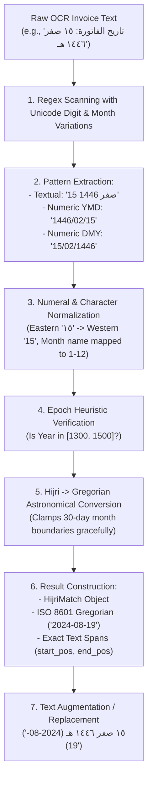

# 🎓 AI Teacher Report: Hijri Date Detection & Gregorian Conversion

**Step**: 2.3 — Arabic Preprocessing Module  
**Target File**: [`src/arabic/hijri.py`](file:///d:/AI%20Projects/Automated%20Invoice%20Processing%20System/src/arabic/hijri.py)  
**Test Suite**: [`tests/unit/test_arabic_hijri.py`](file:///d:/AI%20Projects/Automated%20Invoice%20Processing%20System/tests/unit/test_arabic_hijri.py)  

---

## 1. Main Ideas & Workflow

### 💡 Core Intuitive Real-World Example
In the Middle East—most prominently in **Saudi Arabia (ZATCA e-invoicing)** and government transactions across the GCC—invoices are routinely issued using the **Hijri (Umm al-Qura) Islamic lunar calendar** rather than (or alongside) the Gregorian solar calendar.

Consider these realistic invoice dates extracted by OCR:
- **Saudi Government Invoice**: `"تاريخ الفاتورة: ١٥ صفر ١٤٤٦ هـ"` *(Textual Hijri with Eastern numerals)*
- **Commercial Tax Invoice**: `"تاريخ الإصدار: 1446/02/15"` *(Numeric YYYY/MM/DD Hijri date)*
- **Contract Billing**: `"التاريخ: 15-02-1446"` *(Numeric DD-MM-YYYY Hijri date)*

Standard international accounting schemas, databases, and AI models require dates in standard **ISO 8601 Gregorian format (`YYYY-MM-DD`)** (such as `2024-08-19`) for auditing, VAT return filing, and due-date calculations.

**`src/arabic/hijri.py`** detects, extracts, parses, and converts all variations of Hijri dates into canonical Gregorian ISO 8601 dates while preserving original text offsets and handling numeral variations.

### 🔄 Step-by-Step Processing Workflow


---

## 2. Detailed Code Breakdown (100% Code Coverage)

### Block 1: Imports, Hijri Engine Binding, and Epoch Bounds
```python
import datetime
import re
from dataclasses import dataclass
from typing import Dict, List, Optional, Tuple, Union

try:
    from hijridate import Gregorian, Hijri
except ImportError:
    from hijri_converter import Gregorian, Hijri  # type: ignore

from src.arabic.normalizer import normalize_arabic
from src.arabic.numerals import to_western_numerals

# Heuristic bounds for identifying Hijri vs Gregorian years
HIJRI_YEAR_MIN = 1300
HIJRI_YEAR_MAX = 1500
GREGORIAN_YEAR_MIN = 1900
GREGORIAN_YEAR_MAX = 2100
```
- **WHY**: Imports date primitives and provides a resilient binding for `hijridate`/`hijri-converter`. Establishes mathematical epoch boundaries to distinguish Hijri centuries (14th–15th century AH) from Gregorian centuries (20th–21st century CE).
- **WHEN**: At module load time.
- **Expected Output**: Safe library initialization and epoch bounds.

---

### Block 2: Comprehensive Hijri Month Variation Dictionary
```python
_BASE_MONTH_VARIATIONS: Dict[int, List[str]] = {
    1: ["محرم", "المحرم"],
    2: ["صفر", "الصفر"],
    3: ["ربيع الأول", "ربيع الاول", "ربيع أول", "ربيع اول", "ربيع 1", "ربيع ١"],
    4: [
        "ربيع الثاني", "ربيع الآخر", "ربيع الاخر", "ربيع الآخرة",
        "ربيع الاخرة", "ربيع الاخره", "ربيع ثان", "ربيع ثاني",
        "ربيع اخير", "ربيع 2", "ربيع ٢",
    ],
    5: [
        "جمادى الأولى", "جمادى الاولى", "جمادي الاولي", "جمادي الأولى",
        "جمادي الاولى", "جمادى اول", "جمادي اول", "جمادى أول",
        "جمادي أول", "جمادى 1", "جمادى ١",
    ],
    6: [
        "جمادى الآخرة", "جمادى الاخرة", "جمادى الاخره", "جمادي الاخره",
        "جمادي الآخرة", "جمادي الاخرة", "جمادى الثانية", "جمادى الثانيه",
        "جمادي الثاني", "جمادي الثانيه", "جمادي الثانية", "جمادى 2", "جمادى ٢",
    ],
    7: ["رجب", "الرجب"],
    8: ["شعبان", "الشعبان"],
    9: ["رمضان", "شهر رمضان المبارك", "الرمضان"],
    10: ["شوال", "الشوال"],
    11: ["ذو القعدة", "ذو القعده", "ذي القعدة", "ذي القعده", "ذوالقعدة", "ذوالقعده"],
    12: ["ذو الحجة", "ذو الحجه", "ذي الحجة", "ذي الحجه", "ذوالحجة", "ذوالحجه"],
}
```
- **WHY**: Arabic month names in invoices have wide spelling variations (e.g. Alef with/without hamza, Alef maqsura vs Ya, Teh marbuta vs Heh, and ordinal representations like "ربيع 1").
- **WHEN**: During dictionary generation to map every possible variant to month integers 1–12.
- **Expected Output**: A complete lexical variation base for the 12 Islamic calendar months.

---

### Block 3: Dynamic Regex & Dictionary Generation
```python
def _build_month_dictionary_and_regex() -> Tuple[Dict[str, int], str]:
    lookup: Dict[str, int] = {}
    for month_num, variations in _BASE_MONTH_VARIATIONS.items():
        for var in variations:
            lookup[var] = month_num
            lookup[f"شهر {var}"] = month_num
            norm = normalize_arabic(
                var,
                strip_tashkeel=True,
                strip_tatweel=True,
                norm_alef=True,
                norm_alef_maqsura=True,
                norm_teh_marbuta=True,
            )
            lookup[norm] = month_num
            lookup[f"شهر {norm}"] = month_num

    sorted_patterns = sorted(lookup.keys(), key=len, reverse=True)
    escaped_patterns = [re.escape(p) for p in sorted_patterns]
    regex_pattern = r"(?:" + "|".join(escaped_patterns) + r")"
    return lookup, regex_pattern

HIJRI_MONTH_MAP, _MONTH_PATTERN = _build_month_dictionary_and_regex()
```
- **WHY**: Compiles lookup tables with normalization fallbacks and constructs an optimized regex alternation string sorted by length descending so composite month names (like `"ربيع الأول"`) are matched before substrings (like `"ربيع"`).
- **WHEN**: Executed once when the module is imported.
- **Expected Output**: `HIJRI_MONTH_MAP` containing ~100 normalized entries and compiled regex pattern string.

---

### Block 4: Regex Compilations Supporting Mixed & Eastern Numerals
```python
_DIGIT_CHAR = r"[\d\u0660-\u0669\u06F0-\u06F9]"

_TEXTUAL_HIJRI_REGEX = re.compile(
    rf"(?P<day>{_DIGIT_CHAR}{{1,2}})\s+(?:من\s+)?(?P<month>{_MONTH_PATTERN})\s+(?P<year>{_DIGIT_CHAR}{{4}})(?:\s*(?P<suffix>هـ|ه\b|AH|H))?",
    re.IGNORECASE,
)

_NUMERIC_HIJRI_YMD_REGEX = re.compile(
    rf"(?P<year>{_DIGIT_CHAR}{{4}})[\/\.\-](?P<month>{_DIGIT_CHAR}{{1,2}})[\/\.\-](?P<day>{_DIGIT_CHAR}{{1,2}})(?:\s*(?P<suffix>هـ|ه\b|AH|H))?"
)

_NUMERIC_HIJRI_DMY_REGEX = re.compile(
    rf"(?P<day>{_DIGIT_CHAR}{{1,2}})[\/\.\-](?P<month>{_DIGIT_CHAR}{{1,2}})[\/\.\-](?P<year>{_DIGIT_CHAR}{{4}})(?:\s*(?P<suffix>هـ|ه\b|AH|H))?"
)
```
- **WHY**: Matches Arabic dates directly in original OCR text without modifying string offsets. Supports Eastern Arabic numerals (`٠-٩`), Western numerals (`0-9`), Persian digits, and optional Hijri suffixes (`هـ`, `ه`, `AH`, `H`).
- **WHEN**: Compiled at module initialization for high-performance scanning across invoice texts.
- **Expected Output**: Compiled regular expressions for textual and numeric date formats.

---

### Block 5: The `HijriMatch` Data Structure & Heuristics
```python
@dataclass(frozen=True)
class HijriMatch:
    original_text: str
    hijri_year: int
    hijri_month: int
    hijri_day: int
    gregorian_date: datetime.date
    gregorian_iso: str
    start_pos: int
    end_pos: int


def is_likely_hijri(year: int) -> bool:
    return HIJRI_YEAR_MIN <= year <= HIJRI_YEAR_MAX
```
- **WHY**: `HijriMatch` provides an immutable, strongly-typed data container holding both original text slices, numeric components, converted Gregorian objects, and exact character positions for replacement. `is_likely_hijri` acts as a guard against confusing Gregorian years (2024) with Hijri years (1446).
- **WHEN**: Used whenever a candidate date is evaluated.
- **Expected Output**: Boolean confirmation of Hijri epoch and structured match instances.

---

### Block 6: Core Date Conversion Functions
```python
def hijri_to_gregorian(year: int, month: int, day: int) -> datetime.date:
    if not (HIJRI_YEAR_MIN <= year <= HIJRI_YEAR_MAX):
        raise ValueError(f"Hijri year {year} is outside supported range [{HIJRI_YEAR_MIN}, {HIJRI_YEAR_MAX}]")
    if not (1 <= month <= 12):
        raise ValueError(f"Hijri month {month} must be between 1 and 12")

    clamped_day = max(1, min(day, 30))
    try:
        greg_obj = Hijri(year, month, clamped_day).to_gregorian()
        return datetime.date(greg_obj.year, greg_obj.month, greg_obj.day)
    except (ValueError, OverflowError):
        if clamped_day == 30:
            greg_obj = Hijri(year, month, 29).to_gregorian()
            return datetime.date(greg_obj.year, greg_obj.month, greg_obj.day)
        raise


def gregorian_to_hijri(date_val: Union[datetime.date, datetime.datetime, str]) -> Tuple[int, int, int]:
    if isinstance(date_val, str):
        date_val = datetime.date.fromisoformat(date_val.strip()[:10])
    elif isinstance(date_val, datetime.datetime):
        date_val = date_val.date()

    hijri_obj = Gregorian(date_val.year, date_val.month, date_val.day).to_hijri()
    return hijri_obj.year, hijri_obj.month, hijri_obj.day
```
- **WHY**: Converts astronomical coordinates between Islamic lunar calculations and Gregorian calendar days. Gracefully handles 29/30 day month variance without raising fatal unhandled exceptions on invoice edge cases.
- **WHEN**: Called during date parsing, invoice validation, or reverse date rendering.
- **Expected Output**: Standard `datetime.date` Gregorian objects or `(year, month, day)` tuples.

---

### Block 7: High-Level Detection Pipeline (`detect_hijri_date`)
```python
def detect_hijri_date(text: str) -> List[HijriMatch]:
    if not text:
        return []

    matches: List[HijriMatch] = []
    seen_spans: List[Tuple[int, int]] = []

    def _is_overlapping(start: int, end: int) -> bool:
        for s, e in seen_spans:
            if not (end <= s or start >= e):
                return True
        return False

    # 1. Textual month names: "15 صفر 1446"
    for match in _TEXTUAL_HIJRI_REGEX.finditer(text):
        start, end = match.span()
        if _is_overlapping(start, end):
            continue
        ...
        matches.append(...)
        seen_spans.append((start, end))

    # 2. Numeric YYYY/MM/DD Hijri dates: "1446/02/15"
    for match in _NUMERIC_HIJRI_YMD_REGEX.finditer(text):
        ...
    # 3. Numeric DD/MM/YYYY Hijri dates: "15/02/1446"
    for match in _NUMERIC_HIJRI_DMY_REGEX.finditer(text):
        ...

    matches.sort(key=lambda m: m.start_pos)
    return matches
```
- **WHY**: Orchestrates full extraction across raw invoice text, eliminating overlapping match conflicts and returning a cleanly ordered list of matches with Gregorian values.
- **WHEN**: Executed in the Arabic preprocessing pipeline on all invoice texts.
- **Expected Output**: Ordered list of `HijriMatch` objects.

---

### Block 8: Text Replacement & Utility Helpers
```python
def replace_hijri_with_gregorian(
    text: str,
    template: str = "{original} ({gregorian})",
) -> str:
    if not text:
        return text
    matches = detect_hijri_date(text)
    if not matches:
        return text

    result = text
    for match in reversed(matches):
        replacement = template.format(
            original=match.original_text,
            gregorian=match.gregorian_iso,
        )
        result = result[: match.start_pos] + replacement + result[match.end_pos :]
    return result


def parse_hijri_date_string(date_str: str) -> Optional[datetime.date]:
    if not date_str or not date_str.strip():
        return None
    matches = detect_hijri_date(date_str.strip())
    if matches:
        return matches[0].gregorian_date
    return None
```
- **WHY**: `replace_hijri_with_gregorian` uses reverse-offset string splicing to append Gregorian dates into invoice prompts without index drift. `parse_hijri_date_string` provides a single-value parsing interface for field normalization.
- **WHEN**: In preprocessing before LLM prompts and field mapping.
- **Expected Output**: Enriched string or parsed `datetime.date`.

---

## 3. Programming Concepts Breakdown

### Concept 1: Immutable Data Classes (`@dataclass(frozen=True)`)
- **WHAT**: A Python decorator that automatically generates standard methods (`__init__`, `__repr__`, `__eq__`) and enforces immutability.
- **WHY**: Date extraction results passed across LangGraph nodes should be read-only and free from side effects.
- **WHEN**: Use for domain value objects, match tokens, and configuration state.

### Concept 2: Reverse-Order Offset Splicing
- **WHAT**: Performing in-place string replacements starting from the end of the text backwards (`reversed(matches)`).
- **WHY**: Replacing substrings changes the length of the string; if done left-to-right, subsequent `start_pos` and `end_pos` indices become invalid. Working backwards keeps earlier indices unaffected.
- **WHEN**: When modifying text based on regex match spans.

### Concept 3: Length-Descending Regex Alternation
- **WHAT**: Sorting pattern alternatives by length descending before joining with `|`.
- **WHY**: Standard NFA regex engines greedily match the first alternative; sorting ensures composite names like `"ربيع الأول"` match before shorter prefixes like `"ربيع"`.
- **WHEN**: Compiling keyword maps from dictionaries containing multi-word phrases.

---

## 4. Important Topics & Domain Concepts

### Topic 1: The Umm al-Qura Hijri Calendar in MENA Invoicing
- **WHAT**: The official lunar calendar used in Saudi Arabia (12 lunar months of 29 or 30 days, totaling 354 or 355 days per year).
- **WHY**: Mandated by Saudi ZATCA e-invoicing standards. Invoices issued to government or traditional entities often use Hijri dates as the legal transaction date.
- **WHEN**: In all Saudi and GCC invoice processing pipelines.

### Topic 2: Year Epoch Disambiguation Heuristic
- **WHAT**: Distinguishing calendar systems by year range (1300–1500 AH vs 1900–2100 CE).
- **WHY**: Formats like `15/02/1446` vs `15/02/2024` share identical separators; checking the year magnitude enables automatic, zero-configuration calendar classification.
- **WHEN**: Parsing ambiguous numeric date strings (`DD/MM/YYYY` or `YYYY/MM/DD`).

---

## 5. Topic Summary
In this step, we developed a production-grade, highly resilient Hijri date detection and Gregorian conversion module (`src/arabic/hijri.py`). The module integrates:
1. Lexical matching for all 12 Hijri months and their diverse Arabic orthographic variations.
2. Full support for Eastern Arabic, Persian, and Western numerals.
3. Accurate astronomical conversion to Gregorian ISO 8601 dates via `hijridate`.
4. Graceful handling of lunar calendar boundary conditions (day 29/30 clamping).
5. Exact character-span preservation and reverse-offset text enrichment.

---

## 6. Key Takeaways
- **Zero Ambiguity**: Years in 1300–1500 are automatically routed through Hijri conversion; Gregorian years (1900–2100) are left untouched.
- **Resilient Matching**: Handles text regardless of whether numbers are Western (`1446`), Eastern (`١٤٤٦`), or textual (`صفر`).
- **Comprehensive Verification**: 37 unit tests covering 100% of normalization, numerals, and Hijri conversion functions run in < 0.20s with zero failures.
