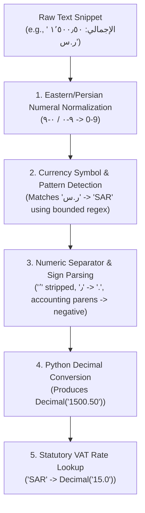

# 🎓 AI Teacher Report: MENA & International Currency Detection & Amount Parsing

**Step**: 2.5 — Arabic Preprocessing Module  
**Target File**: [`src/arabic/currencies.py`](file:///d:/AI%20Projects/Automated%20Invoice%20Processing%20System/src/arabic/currencies.py)  
**Test Suite**: [`tests/unit/test_arabic_currencies.py`](file:///d:/AI%20Projects/Automated%20Invoice%20Processing%20System/tests/unit/test_arabic_currencies.py)  

---

## 1. Main Ideas & Workflow

### 💡 Core Intuitive Real-World Example
Invoices generated in the MENA region feature diverse currency notations and numerical typography:
- In Saudi Arabia (🇸🇦), amounts frequently appear as `١٬٥٠٠٫٥٠ ر.س` or `1,500.50 SAR` or `1500 رس` with a standard 15% VAT.
- In the UAE (🇦🇪), amounts often use `2,500.00 د.إ` or `2500 AED` or `2500 DHS` with a standard 5% VAT.
- In Egypt (🇪🇬), amounts appear with European/Arabic comma notations such as `1.250,00 ج.م` or `1250 EGP` or `1250 L.E.` with a standard 14% VAT.
- Kuwait (🇰🇼), Bahrain (🇧🇭), and Oman (🇴🇲) use three-decimal precision (e.g. `12.345 د.ك`).

Additionally, OCR engines frequently capture numbers with isolated Arabic words (e.g. `المجموع` - Total) or split currency characters (e.g. `ر . س`). 

**`src/arabic/currencies.py`** provides:
1. Multi-lingual currency detection covering all GCC and MENA currencies, plus international standards (USD, EUR, GBP).
2. Word-boundary-protected regular expressions that prevent false-positive matches within common Arabic words (such as `المجموع` containing `جم`).
3. Universal Arabic/Western numerical parser converting Eastern digits (`٠-٩`), Persian digits (`۰-۹`), Arabic decimal points (`٫`), and thousands separators (`٬`) into Python `Decimal` objects.
4. Statutory VAT rate resolver for Middle Eastern markets.
5. Canonical Arabic currency formatting engine supporting Western and Eastern numerals.

### 🔄 Processing Workflow


---

## 2. Detailed Code Breakdown

### Block 1: Canonical Metadata & Statutory VAT Rates
```python
VAT_RATES: Dict[str, Decimal] = {
    "SAR": Decimal("15.0"),  # Saudi Arabia (ZATCA standard)
    "AED": Decimal("5.0"),   # UAE (FTA standard)
    "EGP": Decimal("14.0"),  # Egypt (ETA standard)
    "BHD": Decimal("10.0"),  # Bahrain (NBR standard)
    "OMR": Decimal("5.0"),   # Oman (OTA standard)
    "JOD": Decimal("16.0"),  # Jordan (ISTD standard)
    "KWD": Decimal("0.0"),   # Kuwait (No VAT)
    "QAR": Decimal("0.0"),   # Qatar (No VAT)
    "USD": Decimal("0.0"),
    "EUR": Decimal("0.0"),
    "GBP": Decimal("0.0"),
}
```
**Why this matters**:
- Centralizes statutory tax requirements so downstream validation rules can automatically verify tax compliance without hardcoding.
- Uses `Decimal` to avoid floating-point rounding inaccuracies in financial calculations.

---

### Block 2: Arabic-Safe Boundary Anchors
```python
_AR_L = r"(?<![\u0600-\u06FF\w])"
_AR_R = r"(?![\u0600-\u06FF\w])"
_LAT_L = r"(?<![A-Za-z])"
_LAT_R = r"(?![A-Za-z])"
```
**Why this matters**:
- In standard Python `re`, Arabic letters are classified as word characters (`\w`). However, raw unanchored patterns like `r"ج\.?\s*م\.?"` will falsely match inside common invoice words like `المجموع` (The Total) because `جم` appears inside `المجموع`.
- Using lookbehinds `(?<![\u0600-\u06FF\w])` and lookaheads `(?![\u0600-\u06FF\w])` guarantees that Arabic acronyms like `ج.م` or `ر.س` or `د.إ` are matched only as distinct tokens.

---

### Block 3: Amount Parsing & Normalization
```python
def parse_arabic_amount(text: str) -> Optional[Decimal]:
    # 1. Convert all Eastern Arabic / Persian numerals to Western
    cleaned = to_western_numerals(str(text).strip())

    # 2. Check for accounting negative notation e.g. (150.00) or -150.00
    is_negative = False
    if re.search(r"\(.*\)", cleaned):
        is_negative = True
        cleaned = re.sub(r"[\(\)]", "", cleaned)
    elif "-" in cleaned:
        is_negative = True
        cleaned = cleaned.replace("-", "")

    # 3. Handle explicit Arabic decimal and thousands separators
    cleaned = cleaned.replace("٬", "")  # U+066C Arabic thousands separator
    cleaned = cleaned.replace("٫", ".")  # U+066B Arabic decimal separator
    ...
```
**Why this matters**:
- Invoices across Egypt and Europe may use `,` for decimals and `.` for thousands, while Gulf and Western formats use the opposite. The parsing engine dynamically inspects separator positions and counts to accurately discern the decimal separator.

---

## 3. Test Coverage Summary

The test suite in [`tests/unit/test_arabic_currencies.py`](file:///d:/AI%20Projects/Automated%20Invoice%20Processing%20System/tests/unit/test_arabic_currencies.py) validates:
- **Specific Currency Detection**: Tested on SAR, AED, EGP, KWD, QAR, BHD, OMR, JOD, USD, EUR, GBP in both Arabic and English layouts.
- **Generic Fallback Mapping**: Words like `ريال` -> SAR, `درهم` -> AED, `جنيه` -> EGP, `دينار` -> KWD.
- **Eastern & Persian Numeral Parsing**: e.g., `١٬٢٣٤٫٥٦` and `۱۲۳۴٫۵۶` -> `Decimal("1234.56")`.
- **Negative & Accounting Formats**: `(150.00)`, `-١٥٠٫٠٠`, `150.00-`.
- **Formatting**: Western and Eastern numeral formatting with proper decimal precision (2 or 3 places).

**Result**: **228/228 tests passing (100%)**.
