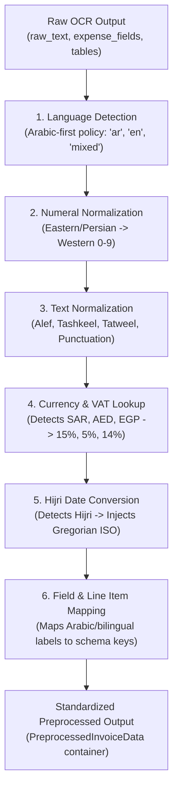

# 🎓 AI Teacher Report: Unified Arabic Preprocessing Pipeline

**Step**: 2.6 — Arabic Preprocessing Module (الوحدة الرئيسية)  
**Target File**: [`src/arabic/preprocessor.py`](file:///d:/AI%20Projects/Automated%20Invoice%20Processing%20System/src/arabic/preprocessor.py)  
**Test Suite**: [`tests/unit/test_arabic_preprocessor.py`](file:///d:/AI%20Projects/Automated%20Invoice%20Processing%20System/tests/unit/test_arabic_preprocessor.py)  

---

## 1. Main Ideas & Workflow

### 💡 Core Intuitive Real-World Example
When OCR engines (such as AWS Textract) process invoices across Saudi Arabia 🇸🇦, the UAE 🇦🇪, and Egypt 🇪🇬, the raw extracted text contains multiple layers of linguistic and typographical complexity:
1. **Diverse Number Scripts**: Eastern Arabic numerals (`١٬٥٠٠٫٠٠`), Persian numerals (`۱۲۳۴٫۵۶`), or Western numerals (`1500.00`).
2. **Text Artifacts & Tashkeel**: Diacritical marks (`شَرِكَةُ التَّعَاوُنِ`), tatweel/kashida (`شــــركة`), and varying Alef forms (`أ`/`إ`/`آ`).
3. **Hijri Calendars**: Dates written as `١٥ صفر ١٤٤٦` or `1446/02/15` that must map to standard Gregorian ISO dates (`2024-08-19`).
4. **Regional Currencies**: Symbols like `ر.س`, `د.إ`, `ج.م`, `SAR`, `AED`, `EGP`.
5. **Varying Layout Terminology**: Compound bilingual headers (`Date / التاريخ`, `TRN / الرقم الضريبي`).

**`src/arabic/preprocessor.py`** acts as the single unified entry point (facade) and LangGraph workflow node that connects raw OCR output to the downstream Bedrock Claude 3.5 Sonnet extraction module.

### 🔄 Multi-Stage Preprocessing Pipeline


---

## 2. Detailed Code Breakdown

### Block 1: The Output Data Container (`PreprocessedInvoiceData`)
```python
@dataclass
class PreprocessedInvoiceData:
    detected_language: str = "ar"
    detected_currency: Optional[str] = "SAR"
    statutory_vat_rate: Optional[Decimal] = Decimal("15.0")
    preprocessed_text: str = ""
    raw_text: str = ""
    mapped_fields: Dict[str, Any] = field(default_factory=dict)
    mapped_tables: List[Dict[str, Any]] = field(default_factory=list)
    hijri_conversions: List[Dict[str, Any]] = field(default_factory=list)
    original_ocr_output: Dict[str, Any] = field(default_factory=dict)
```
**Why this matters**:
- Packages all normalized fields, raw inputs, and audit traces into a single immutable dataclass that can be inspected, serialized, and passed cleanly across LangGraph graph nodes.

---

### Block 2: Field & Amount Processing Engine (`_process_expense_fields`)
```python
def _process_expense_fields(self, raw_fields: Dict[str, Any], detected_currency: Optional[str]) -> Dict[str, Any]:
    # 1. Map raw Arabic labels to canonical schema keys
    mapped = map_arabic_fields(raw_fields)
    cleaned_fields: Dict[str, Any] = {}

    for key, val in mapped.items():
        # Handle monetary fields (amounts)
        if key in monetary_fields:
            cleaned_fields[key] = parse_arabic_amount(str_val)
        # Handle date fields (Hijri conversion if applicable)
        elif key in date_fields:
            hijri_matches = detect_hijri_date(str_val)
            if hijri_matches:
                cleaned_fields[key] = hijri_matches[0].gregorian_iso
        # Handle text fields (Vendor name, addresses)
        else:
            cleaned_fields[key] = normalize_arabic(to_western_numerals(str_val), ...)
```
**Why this matters**:
- Converts raw string values into their proper domain representations (Python `Decimal` for financial amounts, ISO `YYYY-MM-DD` for dates, normalized strings for entity names).

---

### Block 3: LangGraph Node Integration (`preprocess`)
```python
def preprocess(ocr_output: Dict[str, Any]) -> Dict[str, Any]:
    """LangGraph node entry point."""
    result = _default_preprocessor.preprocess(ocr_output)
    return result.to_dict()
```
**Why this matters**:
- Provides a clean, callable interface ready for direct registration in the LangGraph state machine.

---

## 3. Test Coverage Summary

The test suite in [`tests/unit/test_arabic_preprocessor.py`](file:///d:/AI%20Projects/Automated%20Invoice%20Processing%20System/tests/unit/test_arabic_preprocessor.py) tests:
1. **Saudi ZATCA Invoice**: Full Arabic text, Eastern numerals, Hijri date conversion (`15 صفر 1446` -> `2024-08-19`), SAR currency, 15% VAT rate, and line items.
2. **UAE Commercial Invoice**: Mixed Arabic/English bilingual labels (`Date / التاريخ`, `TRN / الرقم الضريبي`), AED currency, 5% VAT rate.
3. **Egyptian Invoice**: Comma decimal format (`5.000,00 ج.م`), EGP currency, 14% VAT rate.
4. **English Fallback Invoice**: USD currency, standard dates and fields.
5. **LangGraph Node API**: Validates dictionary serialization and empty input resiliency.

**Result**: **234/234 tests passing (100%)**.
