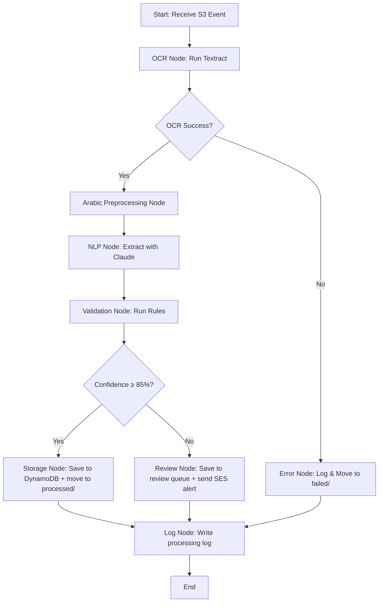

# Automated Invoice Processing System — Implementation Plan

# نظام معالجة الفواتير الآلي

Build an **Arabic-first** AI Agent pipeline targeting the Middle East market (Saudi Arabia, UAE, Egypt) that automatically extracts, validates, and stores structured data from Arabic and bilingual invoices using AWS Textract, Bedrock Claude 3.5 Sonnet, LangChain/LangGraph, and a fully serverless AWS infrastructure.

---

## Design Decisions Summary

| Decision | Choice |
|---|---|
| **Primary Language** | **Arabic (العربية)** — Arabic-first, English-supported |
| **Target Markets** | Saudi Arabia 🇸🇦 (SAR), UAE 🇦🇪 (AED), Egypt 🇪🇬 (EGP) |
| Scope | Core pipeline — Phases 3-5 (Architecture, Development, Testing) |
| AWS Region | `us-east-1` |
| OCR | Textract `AnalyzeExpense` + `AnalyzeDocument` fallback |
| LLM | Bedrock Claude 3.5 Sonnet |
| Agent Framework | LangChain + LangGraph |
| Output | DynamoDB + JSON/CSV export |
| HITL | SES email alerts (Arabic-first) + DynamoDB review queue + Web Dashboard Review |
| **Frontend** | **Modern React Web App (RTL, Arabic-first)** |
| Deployment | AWS SAM (Infrastructure as Code) |
| Confidence Threshold | 85% (composite score) |
| Ingestion | S3 trigger on `invoices/` prefix |
| Supported Formats | PDF, PNG, JPEG, TIFF |
| Arabic Features | Eastern numeral conversion, text normalization, Hijri→Gregorian dates, RTL field mapping, MENA currency detection, VAT ID extraction |
| System Localization | Arabic-first with English fallback (SES emails, error messages, exports) |

---

## Target Market: Middle East (الشرق الأوسط)

| Country | Currency | Currency Symbol (Arabic) | VAT Rate | Invoice Standards |
|---|---|---|---|---|
| 🇸🇦 Saudi Arabia | SAR | ر.س | 15% | ZATCA e-invoicing (فاتورة) |
| 🇦🇪 UAE | AED | د.إ | 5% | FTA Tax Invoice |
| 🇪🇬 Egypt | EGP | ج.م | 14% | ETA e-invoicing |

> [!IMPORTANT]
> Arabic is the **primary language** of this system. The pipeline assumes most invoices will be in Arabic or bilingual (Arabic/English). English-only invoices are supported but are the secondary path.

---

## Extraction Schema

The AI will extract the following **14 fields** from each invoice:

| Field | Arabic Label (الحقل) | Type | Required |
|---|---|---|---|
| `invoice_number` | رقم الفاتورة | string | ✅ |
| `invoice_date` | تاريخ الفاتورة | date (ISO 8601) | ✅ |
| `due_date` | تاريخ الاستحقاق | date (ISO 8601) | ❌ |
| `vendor_name` | اسم المورد | string | ✅ |
| `vendor_address` | عنوان المورد | string | ❌ |
| `vendor_vat_number` | الرقم الضريبي للمورد | string | ❌ |
| `buyer_name` | اسم المشتري | string | ❌ |
| `buyer_vat_number` | الرقم الضريبي للمشتري | string | ❌ |
| `subtotal` | المجموع الفرعي | decimal | ❌ |
| `tax_amount` | مبلغ الضريبة | decimal | ❌ |
| `tax_rate` | نسبة الضريبة | decimal (%) | ❌ |
| `total_amount` | المجموع الكلي | decimal | ✅ |
| `currency` | العملة | string (ISO 4217) | ❌ |
| `line_items` | البنود | array of objects | ❌ |
| `detected_language` | اللغة | string (`ar`, `en`, `mixed`) | auto |

Each **line item** (بند) contains:
| Field | Arabic Label | Type |
|---|---|---|
| `description` | الوصف | string |
| `quantity` | الكمية | decimal |
| `unit_price` | سعر الوحدة | decimal |
| `amount` | المبلغ | decimal |

---

## Validation Rules

1. **Math: Total = Subtotal + Tax** — If subtotal and tax are both present, verify total equals their sum (±0.05 tolerance for rounding).
2. **Math: Line items sum to Subtotal** — If line items and subtotal are present, verify line item amounts sum to subtotal (±0.05).
3. **Required fields** — Reject if `invoice_number`, `invoice_date`, `total_amount`, or `vendor_name` is missing.
4. **Date validation** — Dates must be parseable and not in the future. Supports both Hijri and Gregorian dates (Hijri dates are converted to Gregorian before validation).
5. **Currency consistency** — All monetary fields must use the same currency. Recognizes Arabic currency symbols (ر.س، د.إ، ج.م) and maps them to ISO 4217 codes.
6. **MENA VAT rate validation** — If `tax_rate` is detected and country is identified (via currency), validates against known VAT rates (Saudi 15%, UAE 5%, Egypt 14%).

---

## Proposed Changes

### Project Structure

```
d:\AI Projects\Automated Invoice Processing System\
├── template.yaml                    # AWS SAM template (IaC with API Gateway)
├── samconfig.toml                   # SAM deployment config
├── requirements.txt                 # Python dependencies (Backend)
├── README.md                        # Project documentation
├── .env.example                     # Environment variable template
├── frontend/                        # 🎨 React Web App (Vite)
│   ├── package.json
│   ├── vite.config.js
│   ├── index.html
│   ├── src/
│   │   ├── App.jsx                  # Main application routing
│   │   ├── components/              # Reusable UI components (RTL support)
│   │   ├── pages/
│   │   │   ├── Dashboard.jsx        # Analytics & Export
│   │   │   ├── Upload.jsx           # Drag & Drop upload
│   │   │   └── ReviewQueue.jsx      # Human-in-the-loop review interface
│   │   ├── services/
│   │   │   └── api.js               # API client for AWS API Gateway
│   │   └── styles/
│   │       └── index.css            # Global styles (Tailwind/Vanilla CSS)
├── src/                             # ⚙️ Backend (AWS Lambda)
│   ├── __init__.py
│   ├── handler.py                   # Lambda entry point
│   ├── config.py                    # Configuration & environment variables
│   ├── ocr/
│   │   ├── __init__.py
│   │   ├── textract_client.py       # Textract AnalyzeExpense + AnalyzeDocument
│   │   └── ocr_tool.py             # LangChain Tool wrapper for OCR
│   ├── nlp/
│   │   ├── __init__.py
│   │   ├── bedrock_client.py        # Bedrock Claude 3.5 Sonnet client
│   │   ├── prompts.py              # Prompt templates for extraction
│   │   └── extractor_tool.py       # LangChain Tool wrapper for NLP extraction
│   ├── validation/
│   │   ├── __init__.py
│   │   ├── rules.py                # Validation rule implementations
│   │   └── validation_tool.py      # LangChain Tool wrapper for validation
│   ├── storage/
│   │   ├── __init__.py
│   │   ├── dynamodb_client.py      # DynamoDB read/write operations
│   │   ├── s3_client.py            # S3 operations
│   │   └── export.py               # JSON/CSV export utilities
│   ├── notification/
│   │   ├── __init__.py
│   │   └── ses_client.py           # SES email notifications for HITL
│   ├── agent/
│   │   ├── __init__.py
│   │   ├── graph.py                # LangGraph workflow definition
│   │   ├── state.py                # Agent state schema
│   │   └── tools.py                # Tool registry
│   ├── arabic/                          # 🔑 PRIMARY language module
│   │   ├── __init__.py
│   │   ├── numerals.py             # Eastern Arabic ↔ Western numeral conversion
│   │   ├── normalizer.py           # Arabic text normalization (hamza, tashkeel)
│   │   ├── hijri.py                # Hijri date detection & Gregorian conversion
│   │   ├── field_mapper.py         # Arabic field label → schema field mapping
│   │   ├── currencies.py           # MENA currency detection (ر.س، د.إ، ج.م)
│   │   └── preprocessor.py         # Unified Arabic preprocessing pipeline
│   ├── localization/
│   │   ├── __init__.py
│   │   ├── templates_ar.py         # Arabic email templates & messages
│   │   └── templates_en.py         # English fallback templates
│   └── utils/
│       ├── __init__.py
│       ├── confidence.py           # Composite confidence scoring
│       └── logging.py              # Structured logging utilities
├── tests/
│   ├── __init__.py
│   ├── conftest.py                 # Shared pytest fixtures
│   ├── unit/
│   │   ├── __init__.py
│   │   ├── test_ocr.py
│   │   ├── test_nlp.py
│   │   ├── test_validation.py
│   │   ├── test_confidence.py
│   │   ├── test_storage.py
│   │   └── test_arabic.py          # Arabic preprocessing tests
│   ├── integration/
│   │   ├── __init__.py
│   │   └── test_pipeline.py        # Full pipeline integration tests
│   └── fixtures/
│       └── invoices/               # 5-10 sample invoice files (PDF/PNG)
└── docs/
    └── architecture.md             # Architecture diagram & notes
```

---

### AWS SAM Template (`template.yaml`)

#### [NEW] [template.yaml](file:///d:/AI Projects/Automated Invoice Processing System/template.yaml)

Defines the entire serverless infrastructure:

- **API Gateway** (`InvoiceApi`): REST API to serve frontend requests (`/upload`, `/invoices`, `/invoices/{id}`, `/review`). Configured with CORS for the frontend domain.
- **S3 Bucket** (`InvoiceBucket`): Receives uploaded invoices (via pre-signed URLs from the API). Configured with a notification trigger on the `invoices/` prefix to start processing.
- **Lambda Functions**:
  - `InvoiceProcessorFunction`: Python 3.12, triggered by S3 `ObjectCreated`. Runs the LangGraph AI pipeline.
  - `ApiHandlerFunction`: Python 3.12, triggered by API Gateway. Handles frontend requests (generate S3 pre-signed URLs, fetch DynamoDB data, update review queue status).
- **DynamoDB Tables**:
  - `InvoicesTable`: Stores successfully extracted invoice data. Partition key: `invoice_id` (UUID). GSI on `vendor_name` and `invoice_date`.
  - `ReviewQueueTable`: Stores low-confidence invoices for human review. Partition key: `review_id`. GSI on `status` (PENDING/REVIEWED/REJECTED).
  - `ProcessingLogTable`: Audit trail for every invoice processed. Partition key: `log_id`. GSI on `s3_key` and `timestamp`.
- **CloudWatch Alarm**: Fires when Lambda error rate exceeds threshold.
- **Environment Variables**: Region, table names, confidence threshold (85), SES emails, Bedrock model ID.

---

### Frontend Module (واجهة المستخدم)

> [!IMPORTANT]
> The frontend is an **Arabic-first, RTL-native** React application built with Vite. It provides a visual interface for uploading invoices, viewing analytics, and manually reviewing flagged invoices.

#### Core Pages

1. **Dashboard (لوحة المعلومات)**:
   - Live statistics: Total processed, total VAT, accuracy rate.
   - Filterable data table of processed invoices.
   - One-click export to CSV/Excel.
2. **Upload Portal (رفع الفواتير)**:
   - Drag-and-drop zone for PDF/Images.
   - Requests a pre-signed S3 URL from the backend and uploads the file directly to S3.
   - Real-time progress indicators.
3. **Review Queue (لائحة المراجعة)**:
   - The Human-in-the-loop (HITL) interface.
   - Fetches `PENDING` invoices from the `ReviewQueueTable`.
   - Side-by-side view: Original PDF/Image on the right (or left depending on RTL), extracted editable fields on the other side.
   - Highlights low-confidence fields.
   - "Approve (اعتماد)" button updates the DynamoDB status and moves the record to the `InvoicesTable`.

---

### OCR Module

#### [NEW] [textract_client.py](file:///d:/AI Projects/Automated Invoice Processing System/src/ocr/textract_client.py)

- `analyze_expense(bucket, key)` — Calls Textract `AnalyzeExpense` API. Returns structured expense fields with per-field confidence scores.
- `analyze_document(bucket, key)` — Fallback. Calls Textract `AnalyzeDocument` with `FORMS` and `TABLES` feature types. Returns raw key-value pairs and tables.
- `detect_document_type(expense_response)` — Inspects the AnalyzeExpense response to determine if the document is a valid invoice/receipt. If not (e.g., returns empty or confidence is very low), triggers the AnalyzeDocument fallback.
- Handles Textract API errors and rate limiting with exponential backoff.

#### [NEW] [ocr_tool.py](file:///d:/AI Projects/Automated Invoice Processing System/src/ocr/ocr_tool.py)

- LangChain `@tool` wrapper around the textract client.
- Input: `{bucket: str, key: str}`
- Output: `{raw_text: str, expense_fields: dict, tables: list, confidence_scores: dict, method: "expense"|"document"}`

---

### Arabic Preprocessing Module (الوحدة الرئيسية)

> [!IMPORTANT]
> This is the **core differentiator** of this system. Arabic preprocessing is not an add-on — it's the primary processing path. The pipeline assumes Arabic input by default and applies full normalization. English-only documents pass through with minimal processing.

#### [NEW] [numerals.py](file:///d:/AI Projects/Automated Invoice Processing System/src/arabic/numerals.py)

- `eastern_to_western(text: str) -> str` — Converts Eastern Arabic numerals (٠١٢٣٤٥٦٧٨٩) to Western (0123456789). Also handles Persian/Urdu numeral variants (۰۱۲۳۴۵۶۷۸۹).
- `western_to_eastern(text: str) -> str` — Reverse conversion for Arabic-formatted output.
- `contains_eastern_numerals(text: str) -> bool` — Detects if text contains Eastern Arabic numerals.
- `normalize_all_numerals(text: str) -> str` — Normalizes all numeral variants (Eastern Arabic, Persian, Urdu) to Western for consistent processing.
- Uses Unicode codepoint mapping for reliable conversion.

#### [NEW] [normalizer.py](file:///d:/AI Projects/Automated Invoice Processing System/src/arabic/normalizer.py)

- `normalize_arabic(text: str) -> str` — Full Arabic text normalization pipeline:
  1. **Hamza/Alef normalization**: أ / إ / آ → ا
  2. **Tashkeel removal**: Strips diacritical marks (fathah, dammah, kasrah, shadda, sukun, tanween).
  3. **Tatweel removal**: Strips kashida (ـ) elongation characters.
  4. **Alef Maqsura normalization**: ى → ي (end of word).
  5. **Teh Marbuta normalization**: ة → ه (configurable, off by default).
  6. **Arabic punctuation normalization**: Arabic comma (،) → Western comma, Arabic semicolon (؛) → Western semicolon.
- `detect_language(text: str) -> str` — Returns `"ar"`, `"en"`, or `"mixed"` based on Unicode script analysis (ratio of Arabic vs Latin characters). **Defaults to `"ar"` when ambiguous** (Arabic-first policy).
- `extract_arabic_text_blocks(text: str) -> list[str]` — Splits mixed text into Arabic and non-Arabic blocks for targeted processing.

#### [NEW] [hijri.py](file:///d:/AI Projects/Automated Invoice Processing System/src/arabic/hijri.py)

- `detect_hijri_date(text: str) -> list[HijriMatch]` — Regex-based detection of Hijri dates in common MENA formats:
  - `1446/02/15` or `15-02-1446` or `15/02/1446`
  - `١٤٤٦/٠٢/١٥` (Eastern Arabic numerals)
  - Arabic month names: `15 صفر 1446`, `١٥ محرم ١٤٤٦`
  - All 12 Hijri month names (محرم، صفر، ربيع الأول، ربيع الثاني، جمادى الأولى، جمادى الآخرة، رجب، شعبان، رمضان، شوال، ذو القعدة، ذو الحجة).
- `hijri_to_gregorian(year, month, day) -> date` — Converts Hijri date to Gregorian using the `hijri-converter` library.
- `gregorian_to_hijri(date) -> HijriDate` — Reverse conversion for Arabic-formatted output.
- `replace_hijri_with_gregorian(text: str) -> str` — Finds all Hijri dates in text and appends Gregorian equivalents in parentheses (preserves the original for audit).
- `is_likely_hijri(year: int) -> bool` — Heuristic: years in range 1300-1500 are Hijri, 1900-2100 are Gregorian.

#### [NEW] [field_mapper.py](file:///d:/AI Projects/Automated Invoice Processing System/src/arabic/field_mapper.py)

- `ARABIC_FIELD_MAP` — Comprehensive dictionary mapping Arabic invoice labels to schema fields. Includes **multiple dialect variations** common across Saudi, UAE, and Egyptian invoices:

  | Arabic Labels (with variations) | Schema Field |
  |---|---|
  | رقم الفاتورة، رقم فاتورة، الرقم المرجعي | `invoice_number` |
  | تاريخ الفاتورة، تاريخ الإصدار، التاريخ | `invoice_date` |
  | تاريخ الاستحقاق، تاريخ السداد | `due_date` |
  | اسم المورد، البائع، اسم الشركة | `vendor_name` |
  | عنوان المورد، عنوان البائع | `vendor_address` |
  | الرقم الضريبي، رقم التسجيل الضريبي، الرقم الضريبي للمنشأة | `vendor_vat_number` |
  | اسم المشتري، العميل، اسم الزبون | `buyer_name` |
  | الرقم الضريبي للمشتري | `buyer_vat_number` |
  | المجموع الفرعي، المجموع قبل الضريبة | `subtotal` |
  | الضريبة، ضريبة القيمة المضافة، مبلغ الضريبة، VAT | `tax_amount` |
  | نسبة الضريبة، معدل الضريبة | `tax_rate` |
  | المجموع الكلي، الإجمالي، المجموع شامل الضريبة، الصافي | `total_amount` |
  | العملة | `currency` |
  | الوصف، البيان، التفاصيل | line_item.`description` |
  | الكمية، العدد | line_item.`quantity` |
  | سعر الوحدة، السعر | line_item.`unit_price` |
  | المبلغ، القيمة | line_item.`amount` |

- `map_arabic_fields(ocr_fields: dict) -> dict` — Maps Arabic field labels to schema fields using fuzzy matching (handles OCR typos and alternative spellings).
- Uses normalized text comparison (post-hamza/tashkeel normalization) for robust matching.
- **Handles regional spelling differences** across Saudi, Emirati, and Egyptian Arabic.

#### [NEW] [currencies.py](file:///d:/AI Projects/Automated Invoice Processing System/src/arabic/currencies.py)

- `MENA_CURRENCIES` — Dictionary mapping Arabic currency symbols and names to ISO 4217:

  | Arabic Symbol/Name | ISO Code | Country |
  |---|---|---|
  | ر.س، ريال سعودي، ريال | SAR | Saudi Arabia |
  | د.إ، درهم إماراتي، درهم | AED | UAE |
  | ج.م، جنيه مصري، جنيه | EGP | Egypt |
  | د.ك، دينار كويتي | KWD | Kuwait |
  | ر.ق، ريال قطري | QAR | Qatar |
  | د.ب، دينار بحريني | BHD | Bahrain |
  | ر.ع، ريال عماني | OMR | Oman |
  | د.أ، دينار أردني | JOD | Jordan |

- `detect_currency(text: str) -> str` — Scans text for Arabic currency symbols and returns ISO 4217 code. Handles symbols appearing before or after amounts.
- `parse_arabic_amount(text: str) -> Decimal` — Parses amounts written in Arabic format (e.g., `١٬٢٣٤٫٥٦` or `1,234.56 ر.س`).
- `get_country_vat_rate(currency_code: str) -> Decimal` — Returns the standard VAT rate for the detected country.

#### [NEW] [preprocessor.py](file:///d:/AI Projects/Automated Invoice Processing System/src/arabic/preprocessor.py)

- `preprocess(ocr_output: dict) -> dict` — Unified Arabic-first preprocessing pipeline:
  1. Detect language — **defaults to `"ar"` when ambiguous** (Arabic-first policy).
  2. **Always run**: numeral normalization (Eastern Arabic → Western).
  3. **Always run**: Arabic text normalization (hamza, tashkeel, tatweel).
  4. **Always run**: MENA currency detection.
  5. If Arabic detected: Hijri date conversion → Arabic field label mapping.
  6. If English only: skip Arabic-specific steps but keep numeral and currency normalization.
  7. Attach `detected_language` and `detected_currency` to the output.
- This module is called as a **LangGraph node** between OCR and NLP.

---

### Localization Module (التعريب)

#### [NEW] [templates_ar.py](file:///d:/AI Projects/Automated Invoice Processing System/src/localization/templates_ar.py)

- Arabic-first HTML email templates for SES notifications:
  - `REVIEW_ALERT_AR` — RTL-formatted HTML email with Arabic headers, field labels, and status messages.
  - `SUCCESS_NOTIFICATION_AR` — Optional Arabic confirmation email for processed invoices.
  - Error messages in Arabic: `"فشل التحقق: المجموع لا يتطابق مع المجموع الفرعي + الضريبة"`
- Uses `dir="rtl"` HTML attribute throughout for proper Arabic rendering.

#### [NEW] [templates_en.py](file:///d:/AI Projects/Automated Invoice Processing System/src/localization/templates_en.py)

- English fallback templates (same structure as Arabic, for bilingual support).
- Used when `detected_language == "en"`.

---

### NLP Module

#### [NEW] [bedrock_client.py](file:///d:/AI Projects/Automated Invoice Processing System/src/nlp/bedrock_client.py)

- `extract_invoice_data(ocr_output: dict) -> dict` — Sends OCR output to Bedrock Claude 3.5 Sonnet with a structured prompt. Returns the 12-field extraction schema as a Python dict.
- Uses `bedrock-runtime` `invoke_model` API with `anthropic.claude-3-5-sonnet-20241022-v2:0`.
- Includes retry logic for throttling.

#### [NEW] [prompts.py](file:///d:/AI Projects/Automated Invoice Processing System/src/nlp/prompts.py)

- Contains the extraction prompt template. **Arabic-first** — Claude is instructed to expect Arabic as the primary language:
  ```
  You are an expert Arabic invoice data extraction assistant (مساعد استخراج بيانات الفواتير).
  You specialize in invoices from the Middle East (Saudi Arabia, UAE, Egypt).
  
  PRIMARY LANGUAGE: Arabic (العربية). Most invoices will be in Arabic or bilingual Arabic/English.
  
  Extract the following fields from this invoice text. Return ONLY valid JSON.
  - All field NAMES must be in English (per the schema below).
  - All field VALUES should preserve the original language.
  - Amounts MUST use Western numerals (0-9), even if the source uses Eastern Arabic (٠-٩).
  - Dates MUST be ISO 8601 (YYYY-MM-DD). Hijri dates have been pre-converted — use the Gregorian date.
  - Currency: Detect and output as ISO 4217 code (SAR, AED, EGP, etc.).
  - VAT Number (الرقم الضريبي): Extract if present. Saudi VAT numbers are 15 digits.
  
  Schema: {schema_definition}
  Detected Language: {detected_language}
  Detected Currency: {detected_currency}
  Invoice text: {ocr_text}
  Expense fields (if available): {expense_fields}
  ```
- **Arabic-first few-shot examples** (priority order):
  1. Saudi VAT invoice (فاتورة ضريبية) with ZATCA-style fields
  2. UAE commercial invoice (فاتورة تجارية) with bilingual layout
  3. Egyptian invoice with EGP amounts
  4. English-only invoice (fallback example)

#### [NEW] [extractor_tool.py](file:///d:/AI Projects/Automated Invoice Processing System/src/nlp/extractor_tool.py)

- LangChain `@tool` wrapper around the bedrock client.
- Input: OCR output dict.
- Output: Structured invoice JSON matching the extraction schema.

---

### Validation Module

#### [NEW] [rules.py](file:///d:/AI Projects/Automated Invoice Processing System/src/validation/rules.py)

Implements 6 validation rules as independent functions, each returning `(passed: bool, message: str, message_ar: str)` — **bilingual error messages**:

1. `validate_total_math(data)` — Total = Subtotal + Tax (±0.05).
   - AR: `"فشل التحقق: المجموع ≠ المجموع الفرعي + الضريبة"`
2. `validate_line_items_sum(data)` — Line items sum = Subtotal (±0.05).
   - AR: `"فشل التحقق: مجموع البنود ≠ المجموع الفرعي"`
3. `validate_required_fields(data)` — Checks invoice_number, invoice_date, total_amount, vendor_name.
   - AR: `"حقل مطلوب مفقود: {field_name_ar}"`
4. `validate_dates(data)` — Parseable, not future-dated. Handles both Hijri and Gregorian.
   - AR: `"تاريخ غير صالح أو في المستقبل"`
5. `validate_currency_consistency(data)` — All monetary fields share one currency. Recognizes MENA currency symbols.
   - AR: `"عملات غير متطابقة في الفاتورة"`
6. `validate_mena_vat_rate(data)` — If tax_rate and currency are detected, validates against known MENA VAT rates (Saudi 15%, UAE 5%, Egypt 14%).
   - AR: `"نسبة الضريبة لا تتطابق مع المعدل المعروف للدولة"`

`run_all_validations(data) -> ValidationResult` — Runs all rules, returns aggregate pass/fail + individual results.

#### [NEW] [validation_tool.py](file:///d:/AI Projects/Automated Invoice Processing System/src/validation/validation_tool.py)

- LangChain `@tool` wrapper.
- Input: Extracted invoice data dict.
- Output: `{passed: bool, confidence_adjustment: float, failures: list[str]}`.

---

### Confidence Scoring Module

#### [NEW] [confidence.py](file:///d:/AI Projects/Automated Invoice Processing System/src/utils/confidence.py)

Composite confidence score (0-100) calculated as:

```
composite = (textract_avg_confidence * 0.6) + (validation_score * 0.4)
```

- **Textract component (60%)**: Average of per-field confidence scores from Textract.
- **Validation component (40%)**: 100 if all validations pass, reduced by 20 points per failed rule.
- If composite < 85 → route to human review.

---

### Storage Module

#### [NEW] [dynamodb_client.py](file:///d:/AI Projects/Automated Invoice Processing System/src/storage/dynamodb_client.py)

- `save_invoice(invoice_data: dict)` — Writes to `InvoicesTable`.
- `save_to_review_queue(invoice_data: dict, failures: list, confidence: float)` — Writes to `ReviewQueueTable` with status `PENDING`.
- `log_processing(log_entry: dict)` — Writes to `ProcessingLogTable` with timestamp, S3 key, status, confidence score, processing duration.
- `export_invoices(query_params) -> list[dict]` — Queries InvoicesTable with optional filters.

#### [NEW] [s3_client.py](file:///d:/AI Projects/Automated Invoice Processing System/src/storage/s3_client.py)

- `get_document(bucket, key) -> bytes` — Downloads the invoice file from S3.
- `move_to_processed(bucket, key)` — Moves the file from `invoices/` to `processed/` prefix after successful processing.
- `move_to_failed(bucket, key)` — Moves the file to `failed/` prefix on critical errors.

#### [NEW] [export.py](file:///d:/AI Projects/Automated Invoice Processing System/src/storage/export.py)

- `to_json(invoices: list) -> str` — Exports invoices to JSON.
- `to_csv(invoices: list) -> str` — Exports invoices to CSV with flattened line items.

---

### Notification Module (الإشعارات)

#### [NEW] [ses_client.py](file:///d:/AI Projects/Automated Invoice Processing System/src/notification/ses_client.py)

- `send_review_alert(invoice_data, failures, confidence, s3_key, language="ar")` — Sends an **Arabic-first** HTML email via SES:
  - **Email subject**: `"⚠️ فاتورة تحتاج مراجعة — {vendor_name} — {total_amount} {currency}"`
  - **HTML body** (RTL layout with `dir="rtl"`):
    - Arabic header: `"تنبيه: فاتورة بثقة منخفضة تحتاج إلى مراجعة يدوية"`
    - Invoice details in Arabic labels (المورد، التاريخ، المبلغ)
    - Confidence score with Arabic descriptor (ثقة النظام: ٨٢٪)
    - Validation failures in Arabic (قائمة أسباب الفشل)
    - English summary section at the bottom for bilingual teams
    - Link to the original document in S3
  - Falls back to English template if `language == "en"`

---

### Agent Orchestration (LangGraph)

#### [NEW] [state.py](file:///d:/AI Projects/Automated Invoice Processing System/src/agent/state.py)

Defines the `InvoiceProcessingState` TypedDict:

```python
class InvoiceProcessingState(TypedDict):
    s3_bucket: str
    s3_key: str
    ocr_output: Optional[dict]
    detected_language: Optional[str]  # "ar", "en", or "mixed"
    preprocessed_output: Optional[dict]  # Post-Arabic preprocessing
    extracted_data: Optional[dict]
    validation_result: Optional[dict]
    confidence_score: Optional[float]
    processing_status: str  # "pending" | "processed" | "review" | "failed"
    error: Optional[str]
    processing_log: dict
```

#### [NEW] [graph.py](file:///d:/AI Projects/Automated Invoice Processing System/src/agent/graph.py)

Defines the LangGraph `StateGraph` with the following nodes and edges:



**Nodes:**
1. `ocr_node` — Calls OCR tool, updates state with raw text and confidence scores.
2. `arabic_preprocessing_node` — Detects language, converts Eastern Arabic numerals, normalizes text, converts Hijri dates, maps Arabic field labels. Passes through unchanged for English-only documents.
3. `nlp_node` — Calls NLP extractor tool with preprocessed text and detected language, updates state with structured data.
4. `validation_node` — Calls validation tool, computes composite confidence score.
5. `storage_node` — Saves to InvoicesTable, moves file to `processed/`.
6. `review_node` — Saves to ReviewQueueTable, sends SES alert, moves file to `review/`.
7. `error_node` — Logs error, moves file to `failed/`.
8. `log_node` — Writes processing audit log to ProcessingLogTable.

**Conditional edges:**
- After `ocr_node`: route to `arabic_preprocessing_node` if OCR succeeded, else `error_node`.
- After `validation_node`: route to `storage_node` if confidence ≥ 85%, else `review_node`.

#### [NEW] [tools.py](file:///d:/AI Projects/Automated Invoice Processing System/src/agent/tools.py)

- Registers all LangChain tools (OCR, NLP, Validation) in a tool registry.

---

### Lambda Handler

#### [NEW] [handler.py](file:///d:/AI Projects/Automated Invoice Processing System/src/handler.py)

- Parses the S3 event to extract bucket name and object key.
- Validates the file extension (must be `.pdf`, `.png`, `.jpg`, `.jpeg`, or `.tiff`).
- Initializes the LangGraph workflow and invokes it with the S3 event data.
- Handles top-level exceptions and logs them.

---

### Configuration

#### [NEW] [config.py](file:///d:/AI Projects/Automated Invoice Processing System/src/config.py)

- Reads from environment variables:
  - `AWS_REGION` (default: `us-east-1`)
  - `PRIMARY_LANGUAGE` (default: `ar` — Arabic-first)
  - `INVOICES_TABLE_NAME`
  - `REVIEW_QUEUE_TABLE_NAME`
  - `PROCESSING_LOG_TABLE_NAME`
  - `INVOICE_BUCKET_NAME`
  - `CONFIDENCE_THRESHOLD` (default: `85`)
  - `SES_SENDER_EMAIL`
  - `SES_REVIEWER_EMAIL`
  - `DEFAULT_CURRENCY` (default: `SAR` — Saudi Riyal)
  - `DEFAULT_VAT_RATE` (default: `15` — Saudi VAT rate)
  - `BEDROCK_MODEL_ID` (default: `anthropic.claude-3-5-sonnet-20241022-v2:0`)
- Validated at import time with clear error messages for missing required vars (messages in Arabic and English).

#### [NEW] [.env.example](file:///d:/AI Projects/Automated Invoice Processing System/.env.example)

- Template of all environment variables.

---

### Testing (Arabic-First Test Suite)

#### [NEW] [conftest.py](file:///d:/AI Projects/Automated Invoice Processing System/tests/conftest.py)

- Shared pytest fixtures — **Arabic invoices as primary fixtures**:
  - `mock_textract_response_ar` — Sample AnalyzeExpense response from an Arabic Saudi invoice.
  - `mock_textract_response_en` — Sample AnalyzeExpense response from an English invoice (secondary).
  - `mock_bedrock_response_ar` — Sample Claude extraction response from Arabic text.
  - `sample_invoice_data_saudi` — Pre-extracted Saudi VAT invoice data (SAR, 15% VAT).
  - `sample_invoice_data_uae` — Pre-extracted UAE invoice data (AED, 5% VAT).
  - `sample_invoice_data_egypt` — Pre-extracted Egyptian invoice data (EGP, 14% VAT).
  - `s3_event` — Sample Lambda S3 event payload.

#### [NEW] Unit Tests

- `test_ocr.py` — Tests Textract client with mocked boto3 responses. Tests fallback from AnalyzeExpense to AnalyzeDocument. **Arabic OCR text fixtures**.
- `test_nlp.py` — Tests Bedrock client with mocked responses. Tests Arabic-first prompt construction and JSON parsing with Arabic field values.
- `test_validation.py` — Tests all 6 validation rules including MENA VAT rate validation. Tests with SAR, AED, EGP currencies. Bilingual error messages.
- `test_confidence.py` — Tests composite score calculation with various input combinations.
- `test_storage.py` — Tests DynamoDB operations with mocked boto3. Arabic field values in DynamoDB items.
- `test_arabic.py` — **Comprehensive Arabic preprocessing tests**:
  - Eastern Arabic numeral conversion: `"١٢٣٤٥"` → `"12345"`
  - Hamza/Alef normalization: `"أحمد"` → `"احمد"`
  - Tashkeel removal: `"فَاتُورَة"` → `"فاتورة"`
  - Hijri date detection (all 12 month names) and conversion: `"15 صفر 1446"` → `"2024-08-21"`
  - Arabic field mapping with **regional variations** (Saudi, UAE, Egyptian labels)
  - MENA currency detection: `"ر.س"` → `"SAR"`, `"د.إ"` → `"AED"`, `"ج.م"` → `"EGP"`
  - Arabic amount parsing: `"١٬٢٣٤٫٥٦ ر.س"` → `Decimal("1234.56")`
  - Language detection: Arabic-only, English-only, mixed. **Ambiguous defaults to Arabic.**
  - Full preprocessor pipeline with bilingual Saudi VAT invoice text.
  - VAT number extraction: 15-digit Saudi VAT number.

#### [NEW] Integration Tests

- `test_pipeline.py` — Runs the full LangGraph pipeline against real AWS services. **Test priority order:**
  1. Arabic-only Saudi invoice (فاتورة ضريبية)
  2. Bilingual UAE invoice (Arabic/English)
  3. Arabic Egyptian invoice
  4. English-only invoice
  - Asserts correct DynamoDB entries, S3 file movements, and Arabic SES email delivery.

#### Test Fixtures

- `tests/fixtures/invoices/` — **Arabic-first sample invoices:**
  - `saudi_vat_invoice_ar.pdf` — Saudi VAT invoice (fully Arabic, ZATCA-style)
  - `saudi_invoice_bilingual.pdf` — Saudi bilingual invoice (Arabic primary, English secondary)
  - `uae_commercial_ar.pdf` — UAE commercial invoice (Arabic)
  - `egypt_invoice_ar.pdf` — Egyptian invoice (Arabic)
  - `handwritten_receipt_ar.png` — Arabic handwritten receipt (edge case)
  - `english_invoice.pdf` — English-only invoice (fallback test)

---

### Documentation

#### [NEW] [README.md](file:///d:/AI Projects/Automated Invoice Processing System/README.md)

- Project overview, architecture diagram, setup instructions, deployment guide, and usage examples.

#### [NEW] [architecture.md](file:///d:/AI Projects/Automated Invoice Processing System/docs/architecture.md)

- Detailed architecture diagram (Mermaid), data flow description, and AWS service dependencies.

---

## Verification Plan

### Automated Tests

```bash
# Unit tests (mocked AWS)
pytest tests/unit/ -v

# Integration tests (real AWS — requires configured credentials)
pytest tests/integration/ -v --run-integration
```

### Manual Verification (Arabic-First)

1. **Deploy to AWS** using `sam build && sam deploy --guided`.
2. **Upload an Arabic Saudi invoice** (PDF) to the S3 bucket's `invoices/` prefix.
3. **Verify Arabic extraction** — check DynamoDB `InvoicesTable` for:
   - Arabic vendor name preserved correctly (not garbled)
   - Hijri date converted to Gregorian ISO 8601
   - SAR currency detected from `ر.س`
   - Eastern Arabic numerals converted to Western in amounts
   - VAT number extracted (if present)
4. **Upload a bilingual UAE invoice** and verify both Arabic and English fields are extracted correctly.
5. **Upload a low-quality Arabic invoice** and verify:
   - Routes to `ReviewQueueTable` with Arabic failure messages
   - Triggers SES email in Arabic (RTL layout, Arabic subject line)
6. **Test MENA currencies** — upload invoices with `ر.س` (SAR), `د.إ` (AED), `ج.م` (EGP) and verify correct ISO 4217 mapping.
7. **Upload an English-only invoice** and verify the fallback path works correctly.
8. **Upload an invalid file type** (e.g., .docx) and verify it is rejected gracefully.

---

## Dependencies

```
langchain>=0.3.0
langgraph>=0.2.0
langchain-aws>=0.2.0
boto3>=1.35.0
pydantic>=2.0
python-dateutil>=2.9
hijri-converter>=2.3    # Hijri ↔ Gregorian date conversion
python-bidi>=0.6       # Bidirectional text algorithm (RTL support)
regex>=2024.0          # Enhanced regex for Unicode Arabic patterns
camel-tools>=1.5       # CAMeL Tools: Arabic NLP toolkit (normalization, tokenization)
pytest>=8.0
moto>=5.0              # For mocking AWS in unit tests
```

---

> [!IMPORTANT]
> **Prerequisites before deployment:**
> 1. AWS CLI configured with credentials that have admin access (or at minimum: Textract, Bedrock, DynamoDB, S3, SES, Lambda, CloudWatch, IAM permissions).
> 2. Bedrock Claude 3.5 Sonnet model access must be **enabled** in the AWS console (Bedrock → Model access → Request access for `anthropic.claude-3-5-sonnet`).
> 3. SES sender email must be **verified** in SES (SES is in sandbox mode by default — verify both sender and recipient emails).
> 4. AWS SAM CLI must be installed locally (`pip install aws-sam-cli`).
